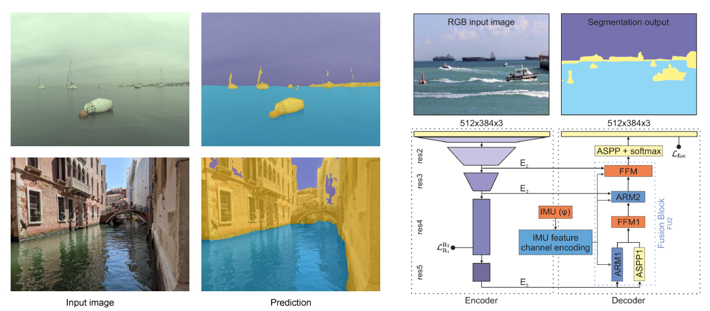

# WaSR: A Water Segmentation and Refinement Maritime Obstacle Detection Network
[[`paper`](https://ieeexplore.ieee.org/document/9477208)] [[`TensorFlow implementation`](https://github.com/bborja/wasr_network)] [[`BibTeX`](#cite)]

PyTorch re-implementation of the WaSR network [[1](#ref-wasr)]. Contains training code, prediction code and models pretrained on the MaSTr1325 dataset [[2](#ref-mastr)]. 

<p align="center">
    
</p>

## Setup

**Requirements**: Python >= 3.6, PyTorch, PyTorch Lightning (for training)

Install the dependencies provided in `requirements.txt`.

```bash
pip install -r requirements.txt
```

## Pretrained models

Currently available pretrained model weights. All models are trained on the MaSTr1325 dataset and evaluated on the MODS benchmark [[3](#ref-mods)].

| model              | backbone   | IMU | url                                                                                       |
|--------------------|------------|-----|-------------------------------------------------------------------------------------------|
| wasr_resnet101     | ResNet-101 |     | [weights](https://github.com/lojzezust/WaSR/releases/download/weights/wasr_rn101.pth)     |
| wasr_resnet101_imu | ResNet-101 | ✓   | [weights](https://github.com/lojzezust/WaSR/releases/download/weights/wasr_rn101_imu.pth) |

## Model training

1. Download and prepare the [MaSTr1325 dataset](https://box.vicos.si/borja/viamaro/index.html#mastr1325) (images and GT masks). If you plan to use the IMU-enabled model also download the IMU masks.
2. Edit the dataset configuration (`configs/mastr1325_train.yaml`, `configs/mastr1325_val.yaml`) files so that they correctly point to the dataset directories.
3. Use the `train.py` to train the network.

```bash
export CUDA_VISIBLE_DEVICES=0,1,2,3 # GPUs to use
python train.py \
--train_config configs/mastr1325_train.yaml \
--val_config configs/mastr1325_val.yaml \
--model_name my_wasr \
--validation \
--batch_size 4 \
--epochs 50
```

### Model architectures

By default the ResNet-101, IMU-enabled version of the WaSR is used in training. To select a different model architecture use the `--model` argument. Currently implemented model architectures:

| model              | backbone   | IMU |
|--------------------|------------|-----|
| wasr_resnet101_imu | ResNet-101 | ✓   |
| wasr_resnet101     | ResNet-101 |     |
| wasr_resnet50_imu  | ResNet-50  | ✓   |
| wasr_resnet50      | ResNet-50  |     |
| deeplab            | ResNet-101 |     |

### Logging and model weights

A log dir with the specified model name will be created inside the `output` directory. Model checkpoints and training logs will be stored here. At the end of the training the model weights are also exported to a `weights.pth` file inside this directory.

Logged metrics (loss, validation accuracy, validation IoU) can be inspected using tensorboard.

```bash
tensorboard --logdir output/logs/model_name
```

## Model inference

To run model inference using pretrained weights use the `predict.py` script. A sample dataset config file (`configs/examples.yaml`) is provided to run examples from the `examples` directory.

```bash
# export CUDA_VISIBLE_DEVICES=-1 # CPU only
export CUDA_VISIBLE_DEVICES=0 # GPU to use
python predict.py \
--dataset_config configs/examples.yaml \
--model wasr_resnet101_imu \
--weights path/to/model/weights.pth \
--output_dir output/predictions
```

Predictions will be stored as color-coded masks to the specified output directory.
## Publication

Lojze Žust & Matej Kristan. "Learning Maritime Obstacle Detection from Weak Annotations by Scaffolding." Accepted to Winter Conference on Applications of Computer Vision (WACV), 2022. [[arXiv](https://arxiv.org/abs/2108.00564)]

### <a name="cite"></a>Citation

If you use this code, please cite our papers:

```bib
@InProceedings{Zust2022Learning,
  title={Learning Maritime Obstacle Detection from Weak Annotations by Scaffolding},
  author={{\v{Z}}ust, Lojze and Kristan, Matej},
  booktitle={Proceedings of the IEEE/CVF Winter Conference on Applications of Computer Vision},
  pages={955--964},
  year={2022}
}
```

```bib
@article{Bovcon2021WaSR,
  title={WaSR--A Water Segmentation and Refinement Maritime Obstacle Detection Network},
  author={Bovcon, Borja and Kristan, Matej},
  journal={IEEE Transactions on Cybernetics}
}
```
## References

<a name="ref-wasr"></a>[1] Bovcon, B., & Kristan, M. (2021). WaSR--A Water Segmentation and Refinement Maritime Obstacle Detection Network. IEEE Transactions on Cybernetics

<a name="ref-mastr"></a>[2] Bovcon, B., Muhovič, J., Perš, J., & Kristan, M. (2019). The MaSTr1325 dataset for training deep USV obstacle detection models. 2019 IEEE/RSJ International Conference on Intelligent Robots and Systems (IROS)

<a name="ref-mods"></a>[3] Bovcon, B., Muhovič, J., Vranac, D., Mozetič, D., Perš, J., & Kristan, M. (2021). MODS -- A USV-oriented object detection and obstacle segmentation benchmark. http://arxiv.org/abs/2105.02359